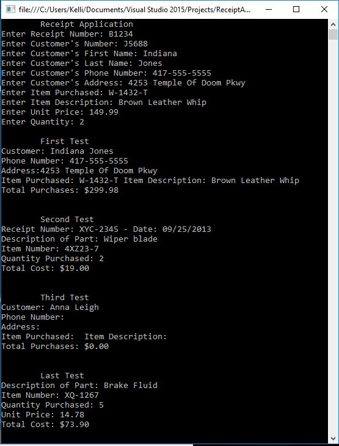

# ReceiptApp
C# Application

## Assignment Details
Create a Receipt class that could be used by a retail store. Items to include as data members are receipt number, customer number, customer name and address, customer phone number, item number, description, unit price, and quanitity purchased. For simplicity, you may assume each receipt is for a single ticket item and contains a single item number. Include appropriate constructors and properties plus an additional method that calculates the total cost using the quantity and unit price. Override the ToString() method to return the information about the customer. Create a second class to test your Receipt class.

## Output

